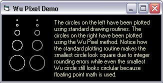



## Wu Pixels

### Description

This code demonstates the use of Wu pixels.

Circles and lines drawn using Wu pixels will have an anti-aliased appearance because this method of plotting uses floating point math to plot pixels in groups of four in a 2x2 block and varying the brightness of the pixels. This program uses no OCX's or third-party DLL's, just VB and the API (SetPixel and GetPixel).
 
### More Info
 

             |
---                |---
**Submitted On**   |2004-03-29 16:53:04
**By**             |[Chris Jennings](https://github.com/Planet-Source-Code/PSCIndex/blob/master/ByAuthor/chris-jennings.md)
**Level**          |Beginner
**User Rating**    |4.9 (34 globes from 7 users)
**Compatibility**  |VB 4\.0 \(32\-bit\), VB 5\.0, VB 6\.0
**Category**       |[Graphics](https://github.com/Planet-Source-Code/PSCIndex/blob/master/ByCategory/graphics__1-46.md)
**World**          |[Visual Basic](https://github.com/Planet-Source-Code/PSCIndex/blob/master/ByWorld/visual-basic.md)
**Archive File**   |[Wu\_Pixels1726113292004\.zip](https://github.com/Planet-Source-Code/chris-jennings-wu-pixels__1-52732/archive/master.zip)

